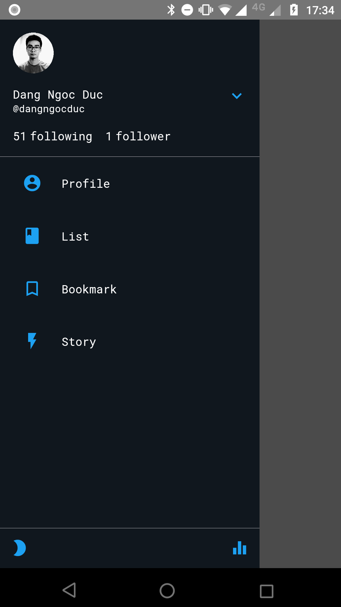

# Step 1

-> react-native init reactnative_twitter_demo
-> install react navigation
	->npm install --save react-navigation
		-> react-native link react-native-gesture-handler
		-> add config for Android on MainActivity(https://reactnavigation.org/docs/en/getting-started.html)

-> config Resource Manager : Colors Theme, Fonts,
	fonts : add font to folder : ./src/resources/fonts
		   config on package.json (https://blog.bam.tech/developper-news/add-a-custom-font-to-your-react-native-app)

## Demo Step 1
    

